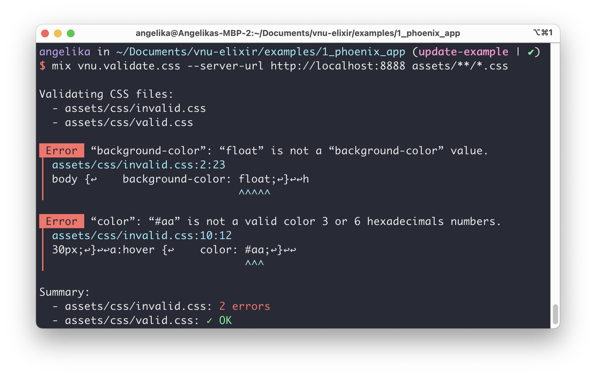

# Vnu

[](https://circleci.com/gh/angelikatyborska/vnu-elixir)


[](https://coveralls.io/github/angelikatyborska/vnu-elixir?branch=master)

An Elixir client for [the Nu HTML Checker (v.Nu)](https://validator.w3.org/nu/).

[v.Nu](https://validator.w3.org/nu/) is a document validity checker used by the W3C.
It offers validating HTML, CSS, and SVG documents.

This library brings that functionality to Elixir by using the Checker's JSON API.
It offers ExUnit assertions for validating dynamic content in tests, Mix tasks for validating static content, and general purpose functions to fulfill other needs.

## Prerequisites

While it is possible to use this library with the service run by W3C at [validator.w3.org/nu](https://validator.w3.org/nu/),
I would recommend running your own instance. You will eliminate a lot of network latency if it runs on the same machine as your code, and you will not hit any rate limits that might exist for [validator.w3.org/nu](https://validator.w3.org/nu/).

The source of the Checker can be found in the repository [validator/validator](https://github.com/validator/validator).
Follow their instructions on how to download it and [run it as a web server](https://github.com/validator/validator#standalone-web-server).

The easiest option is to use the Docker image, like this:
```bash
docker run -it --rm -p 8888:8888 ghcr.io/validator/validator:latest
```

Check if the server is running:
```bash
$ curl localhost:8888 -I
HTTP/1.1 200 OK
```

## Installation

Make sure to read about the [prerequisites](#prerequisites) first.

Add Vnu as a dependency to your project's `mix.exs`. To use the built-in, Hackney-based HTTP client adapter, add `:hackney` too:

```elixir
defp deps do
  [
    {:vnu, "~> 1.1", only: [:dev, :test], runtime: false},
    {:hackney, "~> 1.17"}
  ]
end
```

And run:

```bash
$ mix deps.get
```

## Documentation

[Available on hexdocs.pm](https://hexdocs.pm/vnu/api-reference.html).

## Usage

### ExUnit assertions

If you are building an application that generates HTML, CSS, or SVG files, you might want to use those validations in your tests.

- `Vnu.Assertions.assert_valid_html/2`
- `Vnu.Assertions.assert_valid_css/2`
- `Vnu.Assertions.assert_valid_svg/2`

#### Phoenix controller test example

```elixir
defmodule PhoenixAppWeb.PageControllerTest do
  use PhoenixAppWeb.ConnCase
  import Vnu.Assertions

    test "GET /", %{conn: conn} do
      vnu_opts = %{server_url: "http://localhost:8888", fail_on_warnings: true}
      conn = get(conn, "/")
      
      html_response =
        conn
        |> get("/")
        |> html_response(200)
        |> assert_valid_html(vnu_opts)
      
      assert html_response =~ "Welcome to Phoenix!"
    end
end
```

See [`examples/1_phoenix_app/test/phoenix_app_web/controllers/page_controller_test.exs`](https://github.com/angelikatyborska/vnu-elixir/blob/master/examples/1_phoenix_app/test/phoenix_app_web/controllers/page_controller_test.exs) for more.


### Mix task

If you have static HTML, CSS, or SVG files in your project, you might want to validate them with those mix tasks:

- `mix vnu.validate.html`
- `mix vnu.validate.css`
- `mix vnu.validate.svg`

#### Example

```bash
$ mix vnu.validate.css --server-url localhost:8888 assets/**/*.css
```



### General purpose

If you need HTML, CSS, or SVG validation for something else, try one of those functions:

- `Vnu.validate_html/2`
- `Vnu.validate_css/2`
- `Vnu.validate_svg/2`

```elixir
iex> {:ok, result} = Vnu.validate_html("<!DOCTYPE html><html><head></head></html>",
  server_url: "http://localhost:8888")
{:ok,
 %Vnu.Result{
   messages: [
     %Vnu.Message{
       extract: "tml><head></head></html",
       first_column: 28,
       first_line: 1,
       hilite_length: 7,
       hilite_start: 10,
       last_column: 34,
       last_line: 1,
       message: "Element “head” is missing a required instance of child element “title”.",
       offset: nil,
       sub_type: nil,
       type: :error
     },
     %Vnu.Message{
       extract: "TYPE html><html><head>",
       first_column: 16,
       first_line: 1,
       hilite_length: 6,
       hilite_start: 10,
       last_column: 21,
       last_line: 1,
       message: "Consider adding a “lang” attribute to the “html” start tag to declare the language of this document.",
       offset: nil,
       sub_type: :warning,
       type: :info
     }
   ]
 }}

iex> Vnu.valid?(result)
false
```

## Development

Make sure to read about the [prerequisites](#prerequisites) first.

After cloning the repository, run `mix deps.get` and you should be ready for development.

To ensure code consistency, run `mix format`, `mix credo`, and `mix dialyzer`.

### Running tests

All test that expect to talk with the server accept the server's URL as an `VNU_SERVER_URL` environment variable or fallback to the default `http://localhost:8888`.

```bash
$ VNU_SERVER_URL=http://localhost:4000/ mix test 
```

If you're adding a new test, make sure it will do that do.

## Contributing

### Issues

If you noticed a problem with the library or its documentation, or have an idea for a feature, [open an issue](https://github.com/angelikatyborska/vnu-elixir/issues/new).

If you have an idea on how to act upon the problem or idea, feel free to open a pull request instead.

### Pull requests

If you noticed a problem with the library or its documentation and know how to fix it, or have an idea for a feature, or want to fix a typo, [open a pull request](https://github.com/angelikatyborska/vnu-elixir/pull/new/master).

If you are not sure of your changes or need help finishing them, open a pull request anyway. I'll try to help!

## License

Vnu is released under the MIT License. See the LICENSE file for further details.
