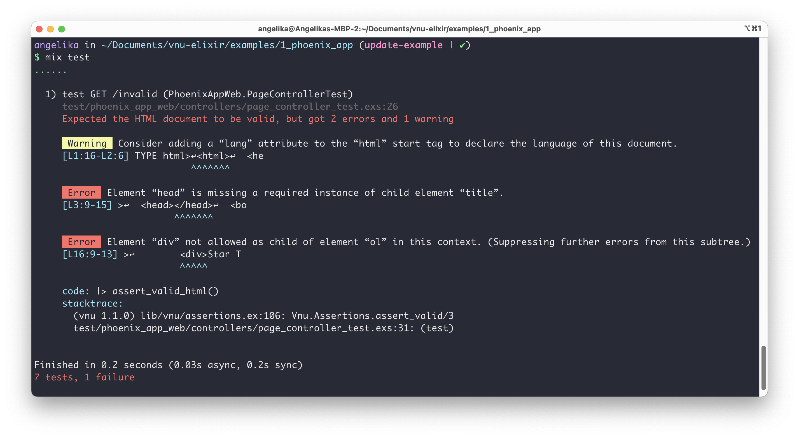
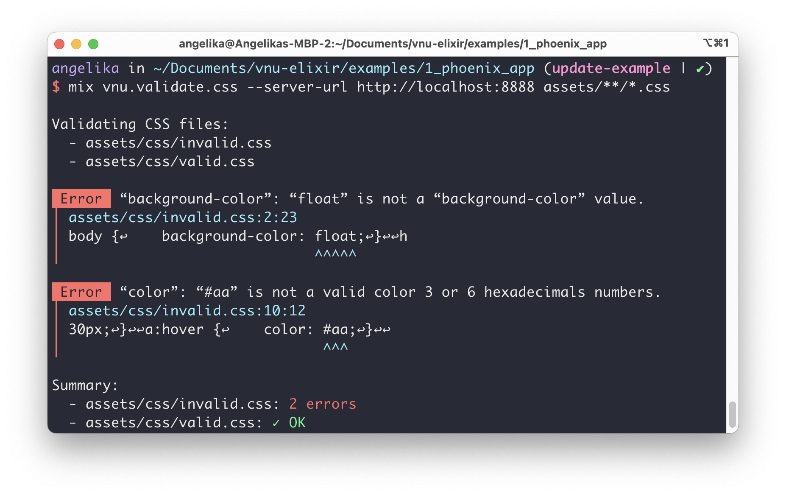

# Vnu usage examples

All examples assume that the Checker server is running on `localhost:8888`.

## 1. Phoenix app

### Controller tests

Take a look at the files [`conn_case.ex`](1_phoenix_app/test/support/conn_case.ex) and [`page_controller_test.exs`](1_phoenix_app/test/phoenix_app_web/controllers/page_controller_test.exs) to see the usage of assertions in controller tests.

Run `mix test` to see the tests failing for invalid HTML and CSS documents.

### Mix task

Run `mix vnu.validate.css --server-url http://localhost:8888 assets/**/*.css` to test the mix task.

## 2. Phoenix app with Mint instead of Hackney

Take a look at the file [`vnu_mint_client.ex`](2_phoenix_app_mint/test/support/vnu_mint_client.ex) to see an example implementation of a custom HTTP client, in this case using [Mint](https://github.com/elixir-mint/mint) instead of Hackney.
